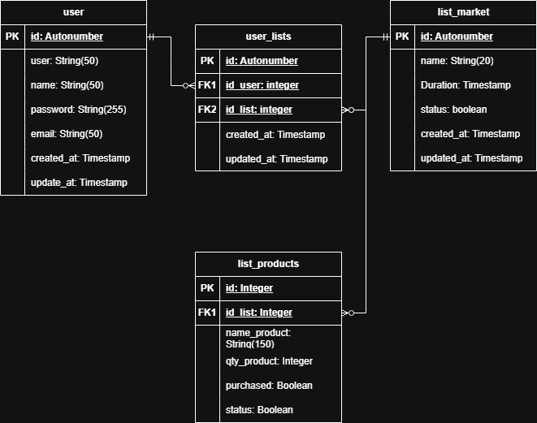

# 🛒 PegaTudo - API  

**PegaTudo** é uma API para gerenciamento de listas de compras colaborativas. Com ela, os usuários podem criar grupos, adicionar produtos a listas compartilhadas e marcar os itens conforme forem sendo adquiridos.  

## 🚀 Funcionalidades  

- ✅ **Autenticação e autorização** com JWT  
- 👥 **Criação e gerenciamento de grupos de compras**  
- 🛍️ **Adição, edição e remoção de produtos nas listas**  
- 📌 **Marcação de itens como adquiridos**  
- 🔍 **Busca e filtragem de listas**  
- 📊 **Registro de histórico de compras (futuro)**  

## 🛠️ Tecnologias  

- **Java 23**  
- **Spring Boot 3.4**  
- **Spring Security (JWT)**  
- **Hibernate / JPA**  
- **MySQL**  
- **Lombok**

## 📌 Como Rodar  

### **Pré-requisitos**  
- Java 23+  
- Maven  
- MySQL

### **Passos**  

1. Clone o repositório:  
   ```bash
   git clone https://github.com/jpramosjp/PegaTudo-api.git
   cd PegaTudo-api
   ```

2. Configure o banco de dados no `application.properties`  

3. Execute a aplicação:  
   ```bash
   mvn spring-boot:run
   ```


## 📐 Diagrama de Entidades  

Abaixo está o diagrama de entidades do **PegaTudo**, representando as principais tabelas e seus relacionamentos:




## 📜 Licença  

Este projeto está sob a licença MIT.  


